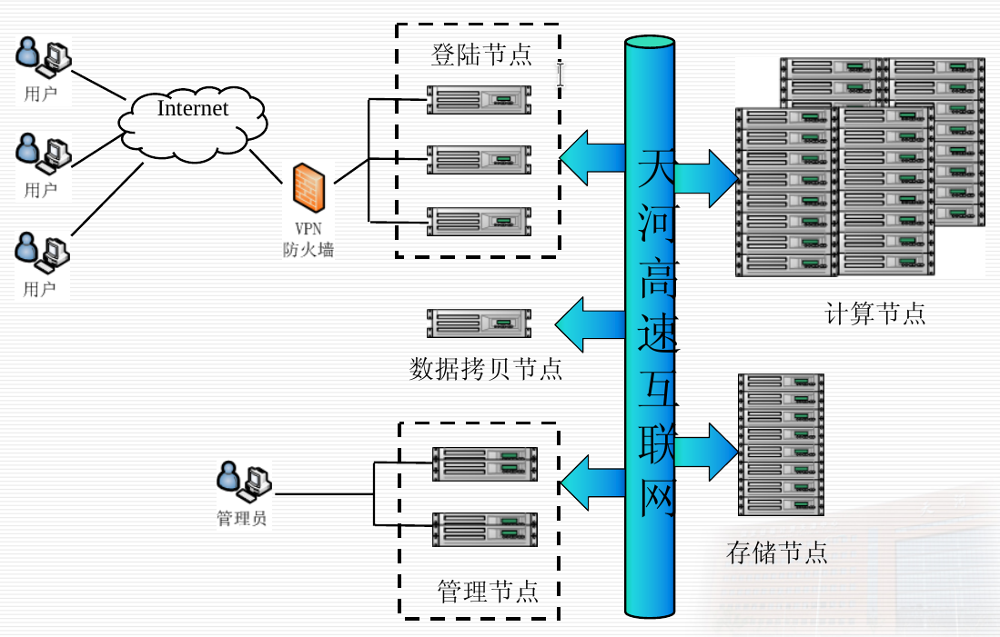

> 最后更新于2019年6月17日

## 天河二号平台架构
天河二号平台中的节点可以分为三种，**登录节点，计算节点和存储节点**，如图：



登录节点
- 在登录节点上用户可以进行软件编译与调试，环境变量配置，作业提交,文件编辑,结果查看等操作。
- **禁止在登录节点上直接运行计算程序。**

计算节点
- 本身没有本地硬盘，挂载共享存储，具备软件运行所需的运行环境

存储节点
- 采用分布式存储文件系统，对外提供一个统一的大分区,供所有登陆节点与计算节点进行挂载。

关于平台架构的更多资料可以参考[天河系统架构及用户使用方法.pdf](/data/天河系统架构及用户使用方法.pdf ':ignore')。

## 技术支持
遇到问题可以发邮件给平台的技术支持："高性能技术支持"<techsupport@nscc-gz.cn>

## 天何星光平台
查看以及管理账号、**机时**、**资源配额**以及作业(task)的一个平台

网址：[https://starlight.nscc-gz.cn/](https://starlight.nscc-gz.cn/)
- 账号：[找YSL或者YWM要]
- 密码：[找YSL或者YWM要]

## 创建应用 & 提交作业
天河星光平台中有一些常用的软件应用，可以一键部署。
自己开发的程序想要运行需要连接到登录节点，编译完成后使用特定程序以作业的形式提交，提交的方法参考
- [天河二号简明使用手册V1.1-BIGDATA1版_20190112.pdf](/data/天河二号简明使用手册V1.1-BIGDATA1版_20190112.pdf ':ignore')

## 连接到登录节点
有两种方式，推荐第一种，无需VPN

### 1. 在网页上连接（WebSSH）

在[集群与分区](https://starlight.nscc-gz.cn/#/resource-manage/hpc/:cluster)页面点击WebSSH按钮连接到登录节点，可以在网页上进入登录节点的命令行界面，体验和一般的Linux相同。


#### 上传文件
需要上传文件的话，可以在[存储管理](https://starlight.nscc-gz.cn/#/storage/storage)页面选择文件目录，再点击上传按钮。


### 2. 通过VPN和SSH连接
#### 连接VPN
连接到登录节点需要先登录其超算中心的VPN，如下：
- 用户名：[找YSL或者YWM要]
- 初始密码：[找YSL或者YWM要]
- key-id: hillstone
- 共享密钥：gzcszx@123 （MAC系统所需）

各操作系统需要使用合适的VPN客户端（Windows：Hillstone Secure Connect，Linux：vpnc，Mac OSX：SCVPN或IPSECVPN），详细信息可以查看[山石VPN用户使用手册20170828.pdf](/data/附件2:山石VPN用户使用手册20170828.pdf ':ignore')。

#### 使用SSH登录
连接VPN后就可以使用SSH连接天河二号的登录节点了，SSH连接信息如下：
- 用户名：[找YSL或者YWM要]
- 端口：5566
- IP：172.16.22.11
- 密钥：[找YSL或者YWM要]

!> 注意每次SSH连接时虽然使用同一个目标IP，但不一定是同一台机器，因此Host Key不一定相同，会导致无法登录，需要关闭SSH的StrictHostKeyChecking，使用命令行的话可以使用下一小节的快捷方式配置。

关于SSH登录的详细资料可以查看[天河二号简明使用手册V1.1-BIGDATA1版_20190112.pdf](/data/天河二号简明使用手册V1.1-BIGDATA1版_20190112.pdf ':ignore')。

##### 在命令行使用SSH登录的快捷方式
先在`~/.ssh/config`中进行配置
```
Host TianHe2
HostName 172.16.22.11
User [找YSL或者YWM要]
Port 5566
StrictHostKeyChecking no
UserKnownHostsFile /dev/null
IdentityFile /path/to/the/key
```

需要连接时运行：
```
ssh TianHe2
```

#### 上传文件

在命令行可以使用SCP命令，或者使用天河提供的sftp服务，详见[天河二号简明使用手册V1.1-BIGDATA1版_20190112.pdf](/data/天河二号简明使用手册V1.1-BIGDATA1版_20190112.pdf ':ignore')
